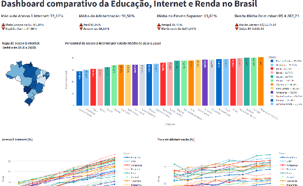

# 📘 Dashboard Interativo — Educação, Inclusão Digital e Renda no Brasil

Inspirado na **Pesquisa TIC Domicílios** e nos **censos do IBGE**, este Dashboard interativo trabalha com dados simulados sobre educação, acesso à internet e renda no Brasil. Integração online com **geobr**. Aplica regressão linear para tendências e contém análise espacial em mapas.

Este projeto apresenta um **dashboard interativo** desenvolvido em **Python + Streamlit** para explorar relações entre:

- Escolaridade

- Acesso à internet

- Renda domiciliar

O objetivo é demonstrar habilidades em análise de dados, visualização e modelagem estatística, utilizando um tema social relevante para o Brasil.

### ⚠️ Aviso importante:📘 Sobre os dados (fictícios)

> - O arquivo educacao_internet_brasil_2018_2025.csv contém dados totalmente simulados.
> 
> - Não representam números oficiais e não devem ser utilizados para pesquisa real.
>
> - A simulação foi inspirada em tendências observadas em bases públicas:
> 
>    - Pesquisa TIC Domicílios (CETIC.br)
> 
>    - Censos e PNADs do IBGE
> 
> - A intenção é exclusivamente educacional e para construção de portfólio.

---

## 📊 Funcionalidades do Dashboard

## 🗺️ 1. Mapa coroplético por estado

Mostra o percentual médio de acesso à internet no período selecionado.

Desenvolvido com Plotly e GeoPandas (via geobr).

Permite filtrar por região, ano e estado.

---

## 📈 2. Gráficos de linha: evolução por indicador

Comparação temporal de:

- Acesso à internet

- Taxa de alfabetização

- Percentual com ensino superior

- Renda média domiciliar

Com opção de exibir valores numéricos diretamente nos pontos.

---

## 📊 3. Ranking e indicadores resumidos

Destaque do estado com maior e menor valor em cada indicador.

Cálculo de médias no período filtrado.

Formatação numérica no padrão brasileiro (R$, %, etc.).

## 🤖 4. Regressão Linear

O projeto inclui uma etapa de modelagem estatística usando Scikit-Learn, onde:

A variável alvo é o percentual de acesso à internet.

As variáveis explicativas são:

Renda média domiciliar

Percentual com ensino superior

### O dashboard:

- Mostra coeficientes, intercepto, interpretação e previsões.

- Oferece interface para o usuário prever valores inserindo renda e escolaridade.

---

### 🧰 Tecnologias utilizadas

|**Categoria**         |**Ferramentas**              |
|----------------------|-----------------------------|
|Linguagem             |Python 3.x                   |
|App / Front-end       |Streamlit                    |
|Visualizações         |Plotly Express               |
|Análise espacial      |geobr, GeoPandas             |
|Machine Learning      |Scikit-Learn                 |
|Manipulação           |Pandas                       |
|Formatação e limpeza  |Regex, funções personalizadas|

---

